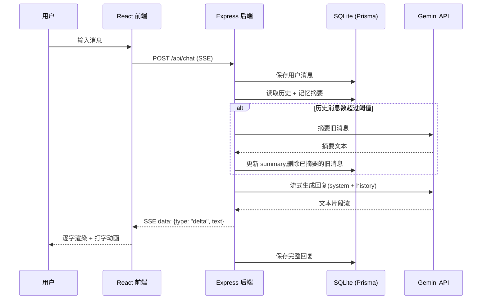

# 角色扮演聊天 Agent

一个全栈角色扮演聊天应用:自定义角色人设、流式对话、长期记忆压缩、跨刷新会话恢复。


## ✨ 功能

- **角色扮演对话**:内置角色(林晚、阿树)+ 可视化表单创建自定义角色,系统会把身份背景 / 性格 / 说话风格拼装成结构化 system prompt
- **流式回复**:后端通过 SSE 把 AI 回复逐字推给前端,带打字动画
- **长期记忆**:对话轮次超过阈值后,自动用 LLM 把旧消息压缩成摘要,注入 system instruction,避免上下文无限增长
- **会话持久化**:`sessionId` 存在 `localStorage`,刷新页面后向后端校验并自动恢复对话(而不是盲目信任本地缓存)
- **失败可感知**:AI 调用失败时前端会显式提示,而不是停在打字动画不动

## 🏗️ 架构



## 🧰 技术栈

| 层 | 技术 |
| --- | --- |
| 前端 | React 18 + TypeScript + Vite |
| 后端 | Node.js + Express + TypeScript |
| 数据库 | SQLite + Prisma ORM |
| AI | Google Gemini API(`@google/genai`,流式生成) |
| 通信 | SSE(Server-Sent Events,手写 fetch + ReadableStream 协议,而非原生 EventSource,因为它只支持 GET) |

## 📁 项目结构

```
roleplay-agent/
├── backend/
│   ├── prisma/
│   │   ├── schema.prisma       # Character / Session / Message 三张表
│   │   └── seed.ts             # 种入内置角色
│   └── src/
│       ├── characters/presets.ts   # 内置角色人设
│       ├── routes/                 # characters / sessions / chat 三组路由
│       ├── services/
│       │   ├── geminiService.ts    # Gemini 流式对话封装
│       │   └── memoryService.ts    # 长期记忆摘要逻辑
│       ├── db/client.ts
│       ├── app.ts
│       └── server.ts
└── frontend/
    └── src/
        ├── api/chatApi.ts          # 后端接口封装(含 SSE 解析)
        ├── hooks/useChatStream.ts  # 流式消息状态管理
        ├── components/
        │   ├── CharacterSelector.tsx
        │   ├── CreateCharacterForm.tsx
        │   ├── ChatWindow.tsx
        │   ├── MessageBubble.tsx
        │   └── TypingIndicator.tsx
        ├── utils/
        │   ├── avatarColor.ts      # 按角色 id 生成渐变头像色
        │   └── sessionStorage.ts   # 本地会话记忆
        └── App.tsx
```

## 🚀 快速开始

### 前置条件
- Node.js 18+
- 一个 [Google AI Studio](https://aistudio.google.com/apikey) 的 Gemini API Key

### 1. 后端

```bash
cd backend
npm install
copy .env.example .env
```

编辑 `.env`,填入你的 `GEMINI_API_KEY`。

```bash
npx prisma migrate dev --name init
npx prisma db seed
npm run dev
```

后端运行在 http://localhost:3001

### 2. 前端

```bash
cd frontend
npm install
npm run dev
```

前端运行在 http://localhost:5173(端口被占用时 Vite 会自动切换),通过 Vite 代理转发 `/api` 请求到后端。

## 📡 API

| 方法 | 路径 | 说明 |
| --- | --- | --- |
| GET | `/api/characters` | 获取角色列表 |
| POST | `/api/characters` | 创建自定义角色 |
| POST | `/api/sessions` | 为某个角色创建新会话 |
| GET | `/api/sessions/:id` | 查询会话是否存在及所属角色(用于刷新恢复) |
| GET | `/api/sessions/:id/messages` | 获取该会话的历史消息 |
| POST | `/api/chat` | 发送消息,SSE 流式返回 AI 回复 |
| GET | `/api/health` | 健康检查 |

## 🗄️ 数据模型

```
Character  id · name · avatarEmoji · tagline · systemPrompt
Session    id · characterId · summary · createdAt · updatedAt
Message    id · sessionId · role(user/assistant) · content · createdAt
```

## 💡 一些实现细节

- **流式协议**:前端没有用原生 `EventSource`(只支持 GET),而是用 `fetch` + `ReadableStream` 手写了一套按 `\n\n` 分帧的 SSE 解析逻辑,支持 POST 请求体。
- **记忆压缩策略**:当会话消息数超过阈值(默认 20 条),最旧的一批消息会被单独发给 LLM 生成摘要,写回 `Session.summary` 并从数据库删除,只保留最近若干条原始消息 + 摘要一起注入 system instruction,让 token 开销不随对话长度线性增长。
- **会话恢复的信任边界**:前端把 `sessionId` 存进 `localStorage`,但刷新后不会直接信任它 —— 会先调用 `GET /api/sessions/:id` 向后端确认会话仍然存在,校验失败会静默清空本地记录并回落到角色选择页,而不是渲染一个访问失败的空聊天框。
- **自定义角色 → system prompt**:创建角色表单只收集"身份背景 / 性格 / 说话风格"等创作性内容,安全红线(不自称 AI、敏感话题礼貌转移等)由后端模板统一追加,用户不需要也不能覆盖它。
- **服务商可替换**:AI 调用被封装在单一的 `geminiService.ts` 里,项目最初是接的 Anthropic Claude API,后来整体切换到 Gemini 只改了这一层,路由和业务逻辑都没动。

## 🔭 后续可扩展方向

- [ ] 用户账号系统(多用户隔离)
- [ ] 自定义角色的编辑 / 删除
- [ ] 消息重新生成 / 编辑
- [ ] Docker 化部署 + CI
- [ ] 语音输入 / 输出
